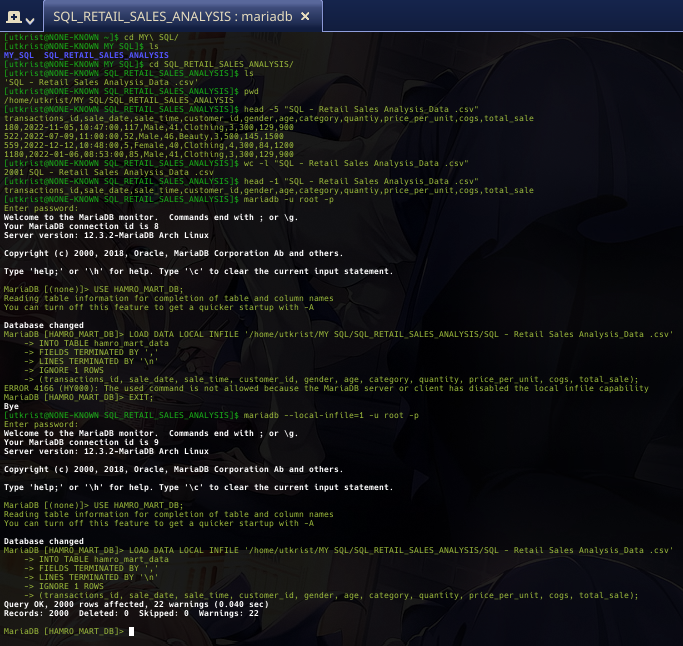

# Retail Sales Analysis SQL Project

## Project Overview

I created this project to practice SQL by working with a retail sales dataset in MariaDB.

Through this project, I am learning how to work with a relational database, clean and explore data, perform SQL analysis, and answer real-world business questions using SQL.

## What I Am Learning

- Work with a relational database
- Explore and understand a dataset
- Clean data and check for missing values
- Use SQL functions such as `COUNT()`, `SUM()`, and `AVG()`
- Use `DISTINCT`, `GROUP BY`, and `ORDER BY`
- Analyze customers, sales, categories, and revenue
- Use `CASE` statements
- Learn Window Functions such as `RANK()`
- Learn Common Table Expressions (CTEs)
- Answer business questions using SQL

## Tools & Technologies

- MariaDB
- SQL
- Git & GitHub


## Project Goals

The main goal of this project is to build my SQL skills through hands-on practice with a real-world-style retail sales dataset.

I will work through the project step by step, starting with database setup and data exploration, then moving toward data cleaning, analysis, and more advanced SQL queries.

# 1. Database Setup
- **Database Creation**: The project starts by creating a database named HAMRO_MART_DB.

- **Table Creation**: A table named `hamro_mart_data` is created to store the retail sales data. The table structure includes columns for transaction ID, sale date, sale time, customer ID, gender, age, product category, quantity sold, price per unit, cost of goods sold (COGS), and total sale amount.

  ```sql
  CREATE DATABASE HAMRO_MART_DB;

  MariaDB [HAMRO_MART_DB]> CREATE TABLE hamro_mart_data
    -> (
    ->     transactions_id INT PRIMARY KEY,
    ->     sale_date DATE,
    ->     sale_time TIME,
    ->     customer_id INT,
    ->     gender VARCHAR(10),
    ->     age INT,
    ->     category VARCHAR(35),
    ->     quantity INT,
    ->     price_per_unit FLOAT,
    ->     cogs FLOAT,
    ->     total_sale FLOAT
    -> );
  ```
# 2. Data Import

I imported the CSV dataset into the `hamro_mart_data` table using MariaDB's
```sql
MariaDB [HAMRO_MART_DB]> LOAD DATA LOCAL INFILE '/home/utkrist/MY SQL/SQL_RETAIL_SALES_ANALYSIS/SQL - Retail Sales Analysis_Data .csv'
    -> INTO TABLE hamro_mart_data
    -> FIELDS TERMINATED BY ','
    -> LINES TERMINATED BY '\n'
    -> IGNORE 1 ROWS
    -> (transactions_id, sale_date, sale_time, customer_id, gender, age, category, quantity, price_per_unit, cogs, total_sale);
```
# Screenshot


# Import Result
The CSV contained 2,000 data records, and all 2,000 records were imported successfully.

# 3. Data Cleaning

After importing the CSV data, I checked the table for missing (`NULL`) values across all columns.

The check showed that there were **0 NULL values** in the 2,000 imported records.

Therefore, no records needed to be deleted due to missing values.

```sql
MariaDB [HAMRO_MART_DB]> SELECT *
    -> FROM hamro_mart_data
    -> WHERE
    ->     transactions_id IS NULL
    ->     OR sale_date IS NULL
    ->     OR sale_time IS NULL
    ->     OR customer_id IS NULL
    ->     OR gender IS NULL
    ->     OR age IS NULL
    ->     OR category IS NULL
    ->     OR quantity IS NULL
    ->     OR price_per_unit IS NULL
    ->     OR cogs IS NULL
    ->     OR total_sale IS NULL;
Empty set (0.002 sec)

MariaDB [HAMRO_MART_DB]> SELECT COUNT(*) AS null_rows
    -> FROM hamro_mart_data
    -> WHERE
    ->     transactions_id IS NULL
    ->     OR sale_date IS NULL
    ->     OR sale_time IS NULL
    ->     OR customer_id IS NULL
    ->     OR gender IS NULL
    ->     OR age IS NULL
    ->     OR category IS NULL
    ->     OR quantity IS NULL
    ->     OR price_per_unit IS NULL
    ->     OR cogs IS NULL
    ->     OR total_sale IS NULL;
+-----------+
| null_rows |
+-----------+
|         0 |
+-----------+
1 row in set (0.002 sec)

MariaDB [HAMRO_MART_DB]> SELECT
    ->     COUNT(*) - COUNT(transactions_id) AS transactions_id_null,
    ->     COUNT(*) - COUNT(sale_date) AS sale_date_null,
    ->     COUNT(*) - COUNT(sale_time) AS sale_time_null,
    ->     COUNT(*) - COUNT(customer_id) AS customer_id_null,
    ->     COUNT(*) - COUNT(gender) AS gender_null,
    ->     COUNT(*) - COUNT(age) AS age_null,
    ->     COUNT(*) - COUNT(category) AS category_null,
    ->     COUNT(*) - COUNT(quantity) AS quantity_null,
    ->     COUNT(*) - COUNT(price_per_unit) AS price_per_unit_null,
    ->     COUNT(*) - COUNT(cogs) AS cogs_null,
    ->     COUNT(*) - COUNT(total_sale) AS total_sale_null
    -> FROM hamro_mart_data;
+----------------------+----------------+----------------+------------------+-------------+----------+---------------+---------------+---------------------+-----------+-----------------+
| transactions_id_null | sale_date_null | sale_time_null | customer_id_null | gender_null | age_null | category_null | quantity_null | price_per_unit_null | cogs_null | total_sale_null |
+----------------------+----------------+----------------+------------------+-------------+----------+---------------+---------------+---------------------+-----------+-----------------+
|                    0 |              0 |              0 |                0 |           0 |        0 |             0 |             0 |                   0 |         0 |               0 |
+----------------------+----------------+----------------+------------------+-------------+----------+---------------+---------------+---------------------+-----------+-----------------+
1 row in set (0.004 sec)

MariaDB [HAMRO_MART_DB]> SHOW WARNINGS;
Empty set (0.000 sec)

MariaDB [HAMRO_MART_DB]> 

```
# 4. Data Analysis & Findings

The following SQL queries were developed to answer specific business questions:

1. **Write a SQL query to retrieve all columns for sales made on '2022-11-05**:
```sql
SELECT * FROM hamro_mart_data WHERE sale_date = '2022-11-05';
```
2. **Write a SQL query to retrieve all transactions where the category is 'Clothing' and the quantity sold is more than 4 in the month of Nov-2022**:
```sql
MariaDB [HAMRO_MART_DB]> SELECT *  FROM hamro_mart_data WHERE category = 'clothing'
    -> AND TO_CHAR(sale_date,'yyyy-MM') = '2022-11'
    -> AND
    -> quantity >= 4;
```
NOTE: WE USED ```SQL TO_CHAR(date_column, 'yyyy-MM') = 'year-month' ```IN POSTGRES SQL BUT WE CAN USE ```SQL DATE_FORMAT(sale_date, '%Y-%m') = 'YEAR-MM' ```THIS FORMAT IN  MARIADB.
